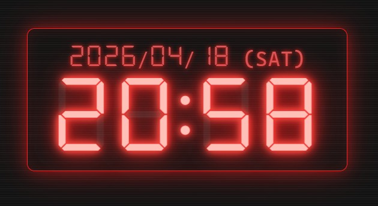
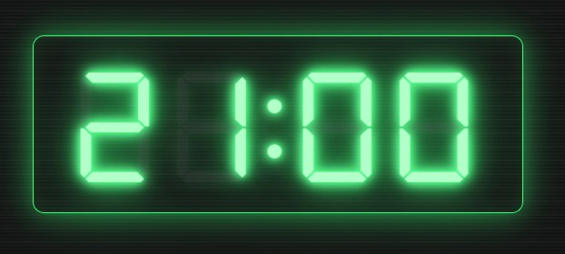
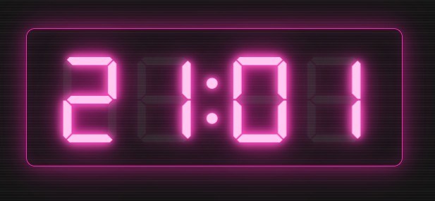

## Tsui Clock v1.3.0  

ネオン発光が気持ちいい、7セグメントフォント対応のサイバーパンク風デジタル時計。

## 特徴  
- **7つのテーマ**  
  発光系: Green / Amber / Red / Pink / Cyber(スキャンライン + 発光 + flickerアニメ付き)  
  ベース系: Auto(システム追従) / Dark(フラット暗色)   
- **3つのFXモード**(発光テーマ用)  
  Off(演出オフ) / On(通常) / Max(発光強化 + グリッチ演出)  
- **背景モード**(BG)  
  Solid(通常) / Ghost1 / Ghost2 / Ghost3 - 背景に変化を
- **3つのフォント**   
  Mono / Consolas / 7-Seg（DSEG7 Classic）  
- **秒表示 ON/OFF**（設定パネルでトグル可能）  
- **日付+曜日表示 ON/OFF**(不要なら非表示にできる)  
- **サイズ調整**（S / M / L / XL / MAX *PC専用・大画面で表示*）  
- **Wake Lock**(設定パネルで切替可能。ONでスリープ抑止、画面常時オン)
- **設定の自動保存**(localStorage に永続化、次回起動時も復元)  
- **PWA対応**  
  ブラウザからインストール可能で、アプリみたいにサクッと使える。 
- **外部依存なし**(CDN非使用、フォントも同梱)  
- **オフライン動作**(初回アクセス後、キャッシュが有効な間はネット接続なしでも動作)  
- **軽量動作**  
- **ダブルクリック/ダブルタップで全画面表示**
- **PiP対応**(Chrome / Edge) ※実験的機能  
  設定パネルの **PIP: Open** でPicture-in-Pictureウィンドウを表示可能。常時最前面に小さな時計を表示できる。ウィンドウサイズや秒表示の組み合わせによって文字がはみ出る場合があります。

## 使い方  
1. https://hajimetwi3.github.io/misc/tools/tsui-clock/ をブラウザから直接開く  
2. PWAとしてインストール(インストールしなくても良い）   
3. 時計部分をタップ → 設定パネルが出る   
4. 好みのテーマ・フォント・サイズ・秒表示・日付表示・Wake Lock・FX・BG をチョイス(設定は自動保存)   
5. ダブルクリック/ダブルタップで全画面表示が可能  
6. 設定パネルの **PIP: Open** で常時最前面の小窓を表示可能(Chrome / Edge)  
    ※PiP利用中は元ウィンドウを最小化すると負荷が抑えられます。  
8. 設定パネルの **About** からバージョン・ライセンス情報を確認可能  

## スクリーンショット  

  
  
  
  

## Changelog  
### v1.0.0  
- 初版リリース  
### v1.1.0  
- ダブルクリック/ダブルタップによる全画面表示機能を追加  
### v1.2.0  
- テーマ追加: **Pink** / **Cyber**(蛍光ピンク・白緑蛍光、ムラのあるネオン感)  
- **Green** / **Red** テーマを蛍光化(中心を白っぽく、周囲に鮮烈な発光)  
- 旧 Cyberpunk テーマを **Green** にリネーム  
- サイズ **MAX** 追加(PC向け、Windowsが大きければ表示)  
- **FX** モード追加(Off / On / Max)。Max では発光強化・スキャンライン移動・時折のグリッチ演出  
- **BG** モード追加(Solid / Ghost1 / Ghost2 / Ghost3)。背景濃度を段階的に下げて透過風の見た目に  
- **日付+曜日の表示 ON/OFF** トグルを追加  
- 設定パネルの行数を整理(SEC+DATE / WAKE+INFO を同一行に統合)  
### v1.3.0  
- **PiP(Picture-in-Picture)** 対応(Chrome / Edge、実験的機能)。設定パネルの PIP: Open から、常時最前面の小窓で時計を表示可能。ウィンドウサイズに合わせて時計も自動で拡大縮小します。  

## ライセンス  

- 本アプリ本体 → [MIT License](./LICENSE)  
- 7セグメントフォント（DSEG） → [SIL Open Font License 1.1](./fonts/DSEG-LICENSE.txt)  

## 作った人  

[Hajime Tsui](https://hajimetwi3.github.io/hajimetwi3/)    
2026  

---  
## 注意事項  
- 本サービスは現状のまま提供されており、動作の保証はありません。利用によって生じた損害について、作成者は一切の責任を負いません。自己責任でご利用ください。
