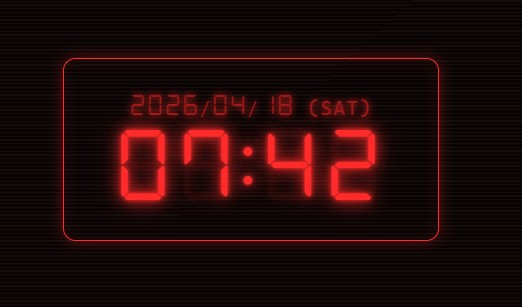
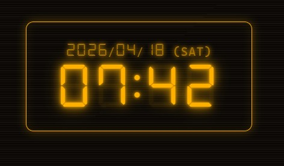
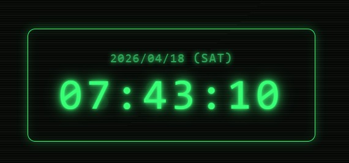
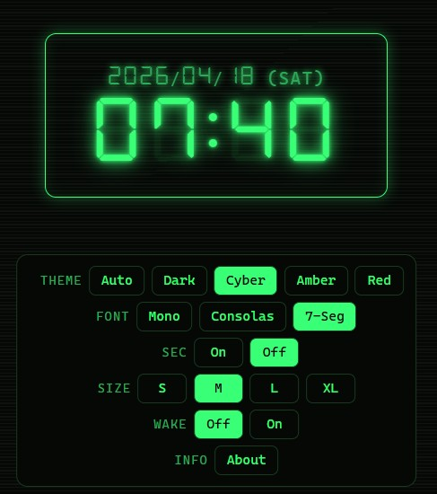

## Tsui Clock v1.1.0  

サイバーパンク・琥珀・レッドのネオン発光が気持ちいい、7セグメントフォント対応のミニマル時計です。

## 特徴  
- **5つのテーマ**  
  発光系: Cyberpunk / Amber / Red(スキャンライン + 発光 + flickerアニメ付き)  
  ベース系: Auto(システム追従) / Dark(フラット暗色)   
- **3つのフォント**   
  Mono / Consolas / 7-Seg（DSEG7 Classic）  
- **秒表示 ON/OFF**（設定パネルでトグル可能）  
- **サイズ調整**（S / M / L / XL）  
- **Wake Lock**(設定パネルで切替可能。ONでスリープ抑止、画面常時オン)
- **日付+曜日表示**(SUN〜SAT)
- **設定の自動保存**(localStorage に永続化、次回起動時も復元)  
- **PWA対応**  
  ブラウザからインストール可能で、アプリみたいにサクッと使える。
- **外部依存なし**(CDN非使用、フォントも同梱)  
- **超軽量動作**  
- **ダブルクリック/ダブルタップで全画面表示**

## 使い方  
1. https://hajimetwi3.github.io/misc/tools/tsui-clock/ をブラウザから直接開く  
2. PWAとしてインストール(インストールしなくても良い）   
3. 時計部分をタップ → 設定パネルが出る   
4. 好みのテーマ・フォント・サイズ・秒表示・Wake Lock をチョイス(設定は自動保存)   
5. ダブルクリック/ダブルタップで全画面表示が可能
6. 設定パネルの **About** からバージョン・ライセンス情報を確認可能  

## スクリーンショット  

  
  
  
  

## Changelog  
### v1.0.0  
- 初版リリース  
### v1.1.0  
- ダブルクリック/ダブルタップによる全画面表示機能を追加  

## ライセンス  

- 本アプリ本体 → [MIT License](./LICENSE)  
- 7セグメントフォント（DSEG） → [SIL Open Font License 1.1](./fonts/DSEG-LICENSE.txt)  

## 作った人  

[Hajime Tsui](https://hajimetwi3.github.io/hajimetwi3/)    
2026  
