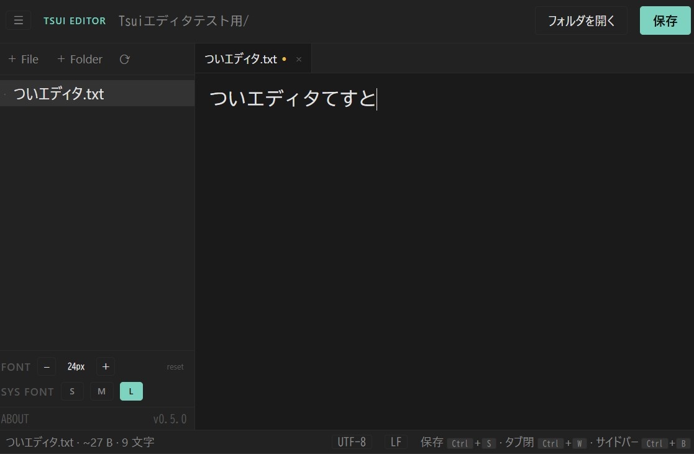

## Tsui editor  
ブラウザでローカルファイルを編集するシンプルなエディタ。ログイン不要、データの外部送信無し。  

## スクリーンショット  

  

## 使い方

1. https://hajimetwi3.github.io/misc/tools/tsui-editor/tsui-editor.html をブラウザから直接開く  
2. PWAとしてインストール(インストールしなくても良い）  
3. 完全オフラインで利用したい場合、https://github.com/hajimetwi3/misc/blob/main/docs/tools/tsui-editor/tsui-editor.html をダウンロードしてブラウザから開き利用する事も可能。  

## ライセンス  

- 本アプリ本体 → [MIT License](./LICENSE)  

## 作った人  

[Hajime Tsui](https://hajimetwi3.github.io/hajimetwi3/)  

---  
## 注意事項  
- 本サービスは現状のまま提供されており、動作の保証はありません。利用によって生じた損害について、作成者は一切の責任を負いません。自己責任でご利用ください。
- ⚠ 権限に関する重要な注意
  - このアプリは、ブラウザのFile System Access API経由で、選択したフォルダ配下のすべてのファイルに対して読み書き・削除の権限を持ちます。  
    そのため、以下のようなシステム的・個人的に重要なフォルダの選択は避けてください。
      - "C:\\" / "/" などルート直下  
      - Desktop / Documents / Downloads  
      - OneDrive / iCloud / Dropbox の同期フォルダ  
      - Git リポジトリや開発プロジェクトのルート  
  - このエディタ専用に作業フォルダ（例: <code>C:\\tsui-workspace\\</code>）を作る事を強く推奨します。
  
